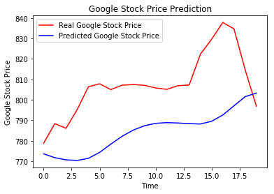

# Part 1 - Data Preprocessing


```python
# Importing the libraries
import numpy as np
import matplotlib.pyplot as plt
import pandas as pd
```


```python
# Importing the dataset
training_set = pd.read_csv('Google_Stock_Price_Train.csv')
```


```python
training_set.shape
```


    (1258, 6)


```python
training_set.head()
```


<div>
<style scoped>
    .dataframe tbody tr th:only-of-type {
        vertical-align: middle;
    }

    .dataframe tbody tr th {
        vertical-align: top;
    }

    .dataframe thead th {
        text-align: right;
    }
</style>
<table border="1" class="dataframe">
  <thead>
    <tr style="text-align: right;">
      <th></th>
      <th>Date</th>
      <th>Open</th>
      <th>High</th>
      <th>Low</th>
      <th>Close</th>
      <th>Volume</th>
    </tr>
  </thead>
  <tbody>
    <tr>
      <th>0</th>
      <td>1/3/2012</td>
      <td>325.25</td>
      <td>332.83</td>
      <td>324.97</td>
      <td>663.59</td>
      <td>7,380,500</td>
    </tr>
    <tr>
      <th>1</th>
      <td>1/4/2012</td>
      <td>331.27</td>
      <td>333.87</td>
      <td>329.08</td>
      <td>666.45</td>
      <td>5,749,400</td>
    </tr>
    <tr>
      <th>2</th>
      <td>1/5/2012</td>
      <td>329.83</td>
      <td>330.75</td>
      <td>326.89</td>
      <td>657.21</td>
      <td>6,590,300</td>
    </tr>
    <tr>
      <th>3</th>
      <td>1/6/2012</td>
      <td>328.34</td>
      <td>328.77</td>
      <td>323.68</td>
      <td>648.24</td>
      <td>5,405,900</td>
    </tr>
    <tr>
      <th>4</th>
      <td>1/9/2012</td>
      <td>322.04</td>
      <td>322.29</td>
      <td>309.46</td>
      <td>620.76</td>
      <td>11,688,800</td>
    </tr>
  </tbody>
</table>
</div>


we are predicting only open price. so we take only Open column


```python
training_set = training_set.iloc[:, 1:2].values
```


```python
# Feature Scaling
from sklearn.preprocessing import MinMaxScaler
sc = MinMaxScaler(feature_range = (0, 1))
training_set = sc.fit_transform(training_set)
```


```python
# Getting the Inputs and Outputs
X_train = training_set[0:1257]
y_train = training_set[1:1258]
```


```python
# Reshaping
X_train = np.reshape(X_train, (1257, 1, 1))
```

# Part 2 - Building the RNN


```python
# Importnig the Keras libraries and Packages
from keras.models import Sequential
from keras.layers import Dense
from keras.layers import LSTM
```

    C:\Users\Hemanth\Anaconda3\lib\site-packages\h5py\__init__.py:36: FutureWarning: Conversion of the second argument of issubdtype from `float` to `np.floating` is deprecated. In future, it will be treated as `np.float64 == np.dtype(float).type`.
      from ._conv import register_converters as _register_converters
    Using TensorFlow backend.
    


```python
# Initializing the RNN
regressor = Sequential()
```


```python
# Adding the Input layer and LSTM layer
regressor.add(LSTM(units = 4, activation = 'sigmoid', input_shape = (None, 1)))
```


```python
# Adding the output layer
regressor.add(Dense(units = 1))
```


```python
# Compiling the RNN
regressor.compile(optimizer = 'adam', loss = 'mean_squared_error')
```


```python
# Fitting the RNN to the Training set
regressor.fit(X_train, y_train, batch_size = 32, epochs = 200)
```

    Epoch 1/200
    1257/1257 [==============================] - 2s 2ms/step - loss: 0.1142
    Epoch 2/200
    1257/1257 [==============================] - 0s 97us/step - loss: 0.0974
    Epoch 3/200
    1257/1257 [==============================] - 0s 117us/step - loss: 0.0907
    Epoch 4/200
    1257/1257 [==============================] - 0s 98us/step - loss: 0.0873
    Epoch 5/200
    1257/1257 [==============================] - 0s 118us/step - loss: 0.0848
    Epoch 6/200
    1257/1257 [==============================] - 0s 92us/step - loss: 0.0825
    Epoch 7/200
    1257/1257 [==============================] - 0s 103us/step - loss: 0.0805
    Epoch 8/200
    1257/1257 [==============================] - 0s 106us/step - loss: 0.0784
    Epoch 9/200
    1257/1257 [==============================] - 0s 116us/step - loss: 0.0765
    Epoch 10/200
    1257/1257 [==============================] - 0s 157us/step - loss: 0.0746
    Epoch 11/200
    1257/1257 [==============================] - 0s 226us/step - loss: 0.0727
    Epoch 12/200
    1257/1257 [==============================] - 0s 122us/step - loss: 0.0709
    Epoch 13/200
    1257/1257 [==============================] - 0s 95us/step - loss: 0.0690
    Epoch 14/200
    1257/1257 [==============================] - 0s 92us/step - loss: 0.0672
    Epoch 15/200
    1257/1257 [==============================] - 0s 93us/step - loss: 0.0653
    Epoch 16/200
    1257/1257 [==============================] - 0s 91us/step - loss: 0.0635
    Epoch 17/200
    1257/1257 [==============================] - 0s 102us/step - loss: 0.0616
    Epoch 18/200
    1257/1257 [==============================] - 0s 102us/step - loss: 0.0598
    Epoch 19/200
    1257/1257 [==============================] - 0s 92us/step - loss: 0.0579
    Epoch 20/200
    1257/1257 [==============================] - 0s 90us/step - loss: 0.0561
    Epoch 21/200
    1257/1257 [==============================] - 0s 86us/step - loss: 0.0541
    Epoch 22/200
    1257/1257 [==============================] - 0s 101us/step - loss: 0.0522
    Epoch 23/200
    1257/1257 [==============================] - 0s 111us/step - loss: 0.0503
    Epoch 24/200
    1257/1257 [==============================] - 0s 89us/step - loss: 0.0483
    Epoch 25/200
    1257/1257 [==============================] - 0s 96us/step - loss: 0.0464
    Epoch 26/200
    1257/1257 [==============================] - 0s 105us/step - loss: 0.0445
    Epoch 27/200
    1257/1257 [==============================] - 0s 96us/step - loss: 0.0425
    Epoch 28/200
    1257/1257 [==============================] - 0s 98us/step - loss: 0.0406
    Epoch 29/200
    1257/1257 [==============================] - 0s 92us/step - loss: 0.0386
    Epoch 30/200
    1257/1257 [==============================] - 0s 100us/step - loss: 0.0367
    Epoch 31/200
    1257/1257 [==============================] - 0s 102us/step - loss: 0.0348
    Epoch 32/200
    1257/1257 [==============================] - 0s 95us/step - loss: 0.0329
    Epoch 33/200
    1257/1257 [==============================] - 0s 101us/step - loss: 0.0311
    Epoch 34/200
    1257/1257 [==============================] - 0s 106us/step - loss: 0.0293
    Epoch 35/200
    1257/1257 [==============================] - 0s 150us/step - loss: 0.0274
    Epoch 36/200
    1257/1257 [==============================] - 0s 125us/step - loss: 0.0256
    Epoch 37/200
    1257/1257 [==============================] - 0s 114us/step - loss: 0.0239
    Epoch 38/200
    1257/1257 [==============================] - 0s 168us/step - loss: 0.0222
    Epoch 39/200
    1257/1257 [==============================] - 0s 157us/step - loss: 0.0205
    Epoch 40/200
    1257/1257 [==============================] - 0s 102us/step - loss: 0.0190
    Epoch 41/200
    1257/1257 [==============================] - 0s 96us/step - loss: 0.0175
    Epoch 42/200
    1257/1257 [==============================] - 0s 156us/step - loss: 0.0161
    Epoch 43/200
    1257/1257 [==============================] - 0s 108us/step - loss: 0.0147
    Epoch 44/200
    1257/1257 [==============================] - 0s 122us/step - loss: 0.0134
    Epoch 45/200
    1257/1257 [==============================] - 0s 121us/step - loss: 0.0122
    Epoch 46/200
    1257/1257 [==============================] - 0s 87us/step - loss: 0.0111
    Epoch 47/200
    1257/1257 [==============================] - 0s 78us/step - loss: 0.0100
    Epoch 48/200
    1257/1257 [==============================] - 0s 94us/step - loss: 0.0090
    Epoch 49/200
    1257/1257 [==============================] - 0s 95us/step - loss: 0.0081
    Epoch 50/200
    1257/1257 [==============================] - 0s 90us/step - loss: 0.0072
    Epoch 51/200
    1257/1257 [==============================] - 0s 83us/step - loss: 0.0064
    Epoch 52/200
    1257/1257 [==============================] - 0s 93us/step - loss: 0.0057
    Epoch 53/200
    1257/1257 [==============================] - 0s 95us/step - loss: 0.0050
    Epoch 54/200
    1257/1257 [==============================] - 0s 97us/step - loss: 0.0044
    Epoch 55/200
    1257/1257 [==============================] - 0s 81us/step - loss: 0.0038
    Epoch 56/200
    1257/1257 [==============================] - 0s 102us/step - loss: 0.0034 0s - loss: 0.003
    Epoch 57/200
    1257/1257 [==============================] - 0s 97us/step - loss: 0.0029
    Epoch 58/200
    1257/1257 [==============================] - 0s 93us/step - loss: 0.0026
    Epoch 59/200
    1257/1257 [==============================] - 0s 90us/step - loss: 0.0022
    Epoch 60/200
    1257/1257 [==============================] - 0s 81us/step - loss: 0.0019
    Epoch 61/200
    1257/1257 [==============================] - 0s 79us/step - loss: 0.0017
    Epoch 62/200
    1257/1257 [==============================] - 0s 77us/step - loss: 0.0015
    Epoch 63/200
    1257/1257 [==============================] - 0s 90us/step - loss: 0.0013
    Epoch 64/200
    1257/1257 [==============================] - 0s 76us/step - loss: 0.0011
    Epoch 65/200
    1257/1257 [==============================] - 0s 191us/step - loss: 9.9539e-04
    Epoch 66/200
    1257/1257 [==============================] - 0s 153us/step - loss: 8.8357e-04
    Epoch 67/200
    1257/1257 [==============================] - 0s 114us/step - loss: 7.9039e-04
    Epoch 68/200
    1257/1257 [==============================] - 0s 85us/step - loss: 7.1465e-04
    Epoch 69/200
    1257/1257 [==============================] - 0s 108us/step - loss: 6.4962e-04
    Epoch 70/200
    1257/1257 [==============================] - 0s 120us/step - loss: 5.9610e-04
    Epoch 71/200
    1257/1257 [==============================] - 0s 109us/step - loss: 5.5149e-04
    Epoch 72/200
    1257/1257 [==============================] - 0s 101us/step - loss: 5.1501e-04
    Epoch 73/200
    1257/1257 [==============================] - 0s 107us/step - loss: 4.8557e-04
    Epoch 74/200
    1257/1257 [==============================] - 0s 122us/step - loss: 4.6033e-04
    Epoch 75/200
    1257/1257 [==============================] - 0s 110us/step - loss: 4.4419e-04
    Epoch 76/200
    1257/1257 [==============================] - 0s 124us/step - loss: 4.2482e-04
    Epoch 77/200
    1257/1257 [==============================] - 0s 174us/step - loss: 4.1119e-04
    Epoch 78/200
    1257/1257 [==============================] - 0s 142us/step - loss: 3.9992e-04
    Epoch 79/200
    1257/1257 [==============================] - 0s 134us/step - loss: 3.9210e-04
    Epoch 80/200
    1257/1257 [==============================] - 0s 108us/step - loss: 3.8338e-04
    Epoch 81/200
    1257/1257 [==============================] - 0s 102us/step - loss: 3.8002e-04
    Epoch 82/200
    1257/1257 [==============================] - 0s 104us/step - loss: 3.7087e-04
    Epoch 83/200
    1257/1257 [==============================] - 0s 92us/step - loss: 3.6478e-04
    Epoch 84/200
    1257/1257 [==============================] - 0s 110us/step - loss: 3.5937e-04
    Epoch 85/200
    1257/1257 [==============================] - 0s 94us/step - loss: 3.5481e-04
    Epoch 86/200
    1257/1257 [==============================] - 0s 96us/step - loss: 3.5220e-04
    Epoch 87/200
    1257/1257 [==============================] - 0s 111us/step - loss: 3.4769e-04
    Epoch 88/200
    1257/1257 [==============================] - 0s 92us/step - loss: 3.4515e-04
    Epoch 89/200
    1257/1257 [==============================] - 0s 98us/step - loss: 3.4225e-04
    Epoch 90/200
    1257/1257 [==============================] - 0s 85us/step - loss: 3.4095e-04
    Epoch 91/200
    1257/1257 [==============================] - 0s 102us/step - loss: 3.3475e-04
    Epoch 92/200
    1257/1257 [==============================] - 0s 99us/step - loss: 3.3194e-04
    Epoch 93/200
    1257/1257 [==============================] - 0s 106us/step - loss: 3.2781e-04
    Epoch 94/200
    1257/1257 [==============================] - 0s 92us/step - loss: 3.2711e-04
    Epoch 95/200
    1257/1257 [==============================] - 0s 101us/step - loss: 3.2298e-04
    Epoch 96/200
    1257/1257 [==============================] - 0s 111us/step - loss: 3.1976e-04
    Epoch 97/200
    1257/1257 [==============================] - 0s 99us/step - loss: 3.1688e-04
    Epoch 98/200
    1257/1257 [==============================] - 0s 110us/step - loss: 3.1396e-04
    Epoch 99/200
    1257/1257 [==============================] - 0s 141us/step - loss: 3.1280e-04
    Epoch 100/200
    1257/1257 [==============================] - 0s 107us/step - loss: 3.0993e-04
    Epoch 101/200
    1257/1257 [==============================] - 0s 112us/step - loss: 3.0906e-04
    Epoch 102/200
    1257/1257 [==============================] - 0s 162us/step - loss: 3.0397e-04
    Epoch 103/200
    1257/1257 [==============================] - 0s 110us/step - loss: 3.0275e-04
    Epoch 104/200
    1257/1257 [==============================] - 0s 108us/step - loss: 3.0216e-04
    Epoch 105/200
    1257/1257 [==============================] - 0s 140us/step - loss: 2.9828e-04
    Epoch 106/200
    1257/1257 [==============================] - 0s 116us/step - loss: 2.9583e-04
    Epoch 107/200
    1257/1257 [==============================] - 0s 256us/step - loss: 2.9314e-04
    Epoch 108/200
    1257/1257 [==============================] - 0s 158us/step - loss: 2.9361e-04
    Epoch 109/200
    1257/1257 [==============================] - 0s 143us/step - loss: 2.8972e-04
    Epoch 110/200
    1257/1257 [==============================] - 0s 133us/step - loss: 2.8762e-04
    Epoch 111/200
    1257/1257 [==============================] - 0s 133us/step - loss: 2.8670e-04
    Epoch 112/200
    1257/1257 [==============================] - 0s 114us/step - loss: 2.8642e-04
    Epoch 113/200
    1257/1257 [==============================] - 0s 120us/step - loss: 2.8320e-04
    Epoch 114/200
    1257/1257 [==============================] - 0s 142us/step - loss: 2.8237e-04
    Epoch 115/200
    1257/1257 [==============================] - 0s 143us/step - loss: 2.8378e-04
    Epoch 116/200
    1257/1257 [==============================] - 0s 104us/step - loss: 2.8093e-04
    Epoch 117/200
    1257/1257 [==============================] - 0s 114us/step - loss: 2.8822e-04
    Epoch 118/200
    1257/1257 [==============================] - 0s 193us/step - loss: 2.7988e-04
    Epoch 119/200
    1257/1257 [==============================] - 0s 185us/step - loss: 2.7761e-04
    Epoch 120/200
    1257/1257 [==============================] - 0s 114us/step - loss: 2.7830e-04
    Epoch 121/200
    1257/1257 [==============================] - 0s 132us/step - loss: 2.7589e-04
    Epoch 122/200
    1257/1257 [==============================] - 0s 116us/step - loss: 2.7446e-04
    Epoch 123/200
    1257/1257 [==============================] - 0s 125us/step - loss: 2.7340e-04
    Epoch 124/200
    1257/1257 [==============================] - 0s 129us/step - loss: 2.7318e-04
    Epoch 125/200
    1257/1257 [==============================] - 0s 135us/step - loss: 2.7350e-04
    Epoch 126/200
    1257/1257 [==============================] - 0s 123us/step - loss: 2.7645e-04
    Epoch 127/200
    1257/1257 [==============================] - 0s 110us/step - loss: 2.7031e-04
    Epoch 128/200
    1257/1257 [==============================] - 0s 123us/step - loss: 2.7165e-04
    Epoch 129/200
    1257/1257 [==============================] - 0s 117us/step - loss: 2.6966e-04
    Epoch 130/200
    1257/1257 [==============================] - 0s 113us/step - loss: 2.6918e-04
    Epoch 131/200
    1257/1257 [==============================] - 0s 160us/step - loss: 2.6833e-04
    Epoch 132/200
    1257/1257 [==============================] - 0s 110us/step - loss: 2.7241e-04
    Epoch 133/200
    1257/1257 [==============================] - 0s 106us/step - loss: 2.6680e-04
    Epoch 134/200
    1257/1257 [==============================] - 0s 108us/step - loss: 2.6594e-04
    Epoch 135/200
    1257/1257 [==============================] - 0s 107us/step - loss: 2.7566e-04
    Epoch 136/200
    1257/1257 [==============================] - 0s 104us/step - loss: 2.6430e-04
    Epoch 137/200
    1257/1257 [==============================] - 0s 85us/step - loss: 2.6498e-04
    Epoch 138/200
    1257/1257 [==============================] - 0s 113us/step - loss: 2.6416e-04
    Epoch 139/200
    1257/1257 [==============================] - 0s 100us/step - loss: 2.6360e-04
    Epoch 140/200
    1257/1257 [==============================] - 0s 111us/step - loss: 2.6579e-04
    Epoch 141/200
    1257/1257 [==============================] - 0s 101us/step - loss: 2.6247e-04
    Epoch 142/200
    1257/1257 [==============================] - 0s 120us/step - loss: 2.6263e-04
    Epoch 143/200
    1257/1257 [==============================] - 0s 96us/step - loss: 2.6340e-04
    Epoch 144/200
    1257/1257 [==============================] - 0s 102us/step - loss: 2.6246e-04
    Epoch 145/200
    1257/1257 [==============================] - 0s 94us/step - loss: 2.6333e-04
    Epoch 146/200
    1257/1257 [==============================] - 0s 110us/step - loss: 2.6311e-04
    Epoch 147/200
    1257/1257 [==============================] - 0s 101us/step - loss: 2.6248e-04
    Epoch 148/200
    1257/1257 [==============================] - 0s 117us/step - loss: 2.6096e-04
    Epoch 149/200
    1257/1257 [==============================] - 0s 116us/step - loss: 2.6405e-04
    Epoch 150/200
    1257/1257 [==============================] - 0s 142us/step - loss: 2.6291e-04
    Epoch 151/200
    1257/1257 [==============================] - 0s 97us/step - loss: 2.5996e-04
    Epoch 152/200
    1257/1257 [==============================] - 0s 104us/step - loss: 2.6113e-04
    Epoch 153/200
    1257/1257 [==============================] - ETA: 0s - loss: 2.6137e-0 - 0s 142us/step - loss: 2.6034e-04
    Epoch 154/200
    1257/1257 [==============================] - 0s 144us/step - loss: 2.5969e-04
    Epoch 155/200
    1257/1257 [==============================] - 0s 156us/step - loss: 2.5907e-04
    Epoch 156/200
    1257/1257 [==============================] - 0s 152us/step - loss: 2.6336e-04
    Epoch 157/200
    1257/1257 [==============================] - 0s 164us/step - loss: 2.5981e-04
    Epoch 158/200
    1257/1257 [==============================] - 0s 187us/step - loss: 2.5952e-04
    Epoch 159/200
    1257/1257 [==============================] - 0s 145us/step - loss: 2.6384e-04
    Epoch 160/200
    1257/1257 [==============================] - 0s 144us/step - loss: 2.6235e-04
    Epoch 161/200
    1257/1257 [==============================] - 0s 168us/step - loss: 2.6672e-04
    Epoch 162/200
    1257/1257 [==============================] - 0s 174us/step - loss: 2.5880e-04
    Epoch 163/200
    1257/1257 [==============================] - 0s 141us/step - loss: 2.5701e-04
    Epoch 164/200
    1257/1257 [==============================] - 0s 109us/step - loss: 2.5786e-04
    Epoch 165/200
    1257/1257 [==============================] - 0s 98us/step - loss: 2.5699e-04
    Epoch 166/200
    1257/1257 [==============================] - 0s 152us/step - loss: 2.5712e-04
    Epoch 167/200
    1257/1257 [==============================] - 0s 165us/step - loss: 2.5668e-04
    Epoch 168/200
    1257/1257 [==============================] - 0s 198us/step - loss: 2.5653e-04
    Epoch 169/200
    1257/1257 [==============================] - 0s 162us/step - loss: 2.5940e-04
    Epoch 170/200
    1257/1257 [==============================] - 0s 148us/step - loss: 2.5981e-04
    Epoch 171/200
    1257/1257 [==============================] - 0s 166us/step - loss: 2.6491e-04
    Epoch 172/200
    1257/1257 [==============================] - 0s 150us/step - loss: 2.5520e-04
    Epoch 173/200
    1257/1257 [==============================] - 0s 187us/step - loss: 2.5771e-04
    Epoch 174/200
    1257/1257 [==============================] - 0s 148us/step - loss: 2.5666e-04
    Epoch 175/200
    1257/1257 [==============================] - 0s 172us/step - loss: 2.6024e-04
    Epoch 176/200
    1257/1257 [==============================] - 0s 171us/step - loss: 2.5642e-04
    Epoch 177/200
    1257/1257 [==============================] - 0s 207us/step - loss: 2.5654e-04
    Epoch 178/200
    1257/1257 [==============================] - 0s 153us/step - loss: 2.6266e-04
    Epoch 179/200
    1257/1257 [==============================] - 0s 144us/step - loss: 2.5591e-04
    Epoch 180/200
    1257/1257 [==============================] - 0s 162us/step - loss: 2.5440e-04
    Epoch 181/200
    1257/1257 [==============================] - 0s 158us/step - loss: 2.5433e-04
    Epoch 182/200
    1257/1257 [==============================] - 0s 119us/step - loss: 2.5382e-04
    Epoch 183/200
    1257/1257 [==============================] - 0s 114us/step - loss: 2.5650e-04
    Epoch 184/200
    1257/1257 [==============================] - 0s 148us/step - loss: 2.5559e-04
    Epoch 185/200
    1257/1257 [==============================] - 0s 199us/step - loss: 2.5526e-04
    Epoch 186/200
    1257/1257 [==============================] - 0s 166us/step - loss: 2.5343e-04
    Epoch 187/200
    1257/1257 [==============================] - 0s 173us/step - loss: 2.5699e-04 0s - loss: 1.8271e
    Epoch 188/200
    1257/1257 [==============================] - 0s 179us/step - loss: 2.5583e-04
    Epoch 189/200
    1257/1257 [==============================] - 0s 126us/step - loss: 2.5696e-04
    Epoch 190/200
    1257/1257 [==============================] - 0s 122us/step - loss: 2.5530e-04
    Epoch 191/200
    1257/1257 [==============================] - 0s 110us/step - loss: 2.5179e-04
    Epoch 192/200
    1257/1257 [==============================] - 0s 122us/step - loss: 2.5852e-04
    Epoch 193/200
    1257/1257 [==============================] - 0s 119us/step - loss: 2.5162e-04
    Epoch 194/200
    1257/1257 [==============================] - 0s 146us/step - loss: 2.5683e-04
    Epoch 195/200
    1257/1257 [==============================] - 0s 112us/step - loss: 2.5646e-04
    Epoch 196/200
    1257/1257 [==============================] - 0s 121us/step - loss: 2.5480e-04
    Epoch 197/200
    1257/1257 [==============================] - 0s 113us/step - loss: 2.5269e-04
    Epoch 198/200
    1257/1257 [==============================] - 0s 161us/step - loss: 2.5202e-04
    Epoch 199/200
    1257/1257 [==============================] - 0s 224us/step - loss: 2.5517e-04
    Epoch 200/200
    1257/1257 [==============================] - 0s 210us/step - loss: 2.5589e-04
    


    <keras.callbacks.History at 0x1c5873a1dd8>


# Part 3 - Making the Predictions and Visualizing the results


```python
# Getting the Real Stock Price
test_set = pd.read_csv('Google_Stock_Price_Test.csv')
real_stock_price = test_set.iloc[:, 1:2].values
```


```python
# Getting the Predicted Stock Price
inputs = real_stock_price
inputs = sc.transform(inputs)
inputs = np.reshape(inputs, (20, 1, 1))
predicted_stock_price = regressor.predict(inputs)
predicted_stock_price = sc.inverse_transform(predicted_stock_price)
```


```python
# Visualising the results
plt.plot(real_stock_price, color = 'red', label = 'Real Google Stock Price')
plt.plot(predicted_stock_price, color = 'blue', label = 'Predicted Google Stock Price')
plt.title('Google Stock Price Prediction')
plt.xlabel('Time')
plt.ylabel('Google Stock Prices')
plt.legend()
plt.show()
```





```python
# Getting the real stock price of 2012 - 2016
real_stock_price_train = pd.read_csv('Google_Stock_Price_Train.csv')
real_stock_price_train = real_stock_price_train.iloc[:, 1:2].values
```


```python
# Getting the predicted stock price of 2012 - 2016
predicted_stock_price_train = regressor.predict(X_train)
predicted_stock_price_train = sc.inverse_transform(predicted_stock_price_train)
```


```python
# Visualing the results
plt.plot(real_stock_price_train, color = 'red', label = 'Real Google Stock Price')
plt.plot(predicted_stock_price_train, color = 'blue', label = 'Predicted Google Stock Price')
plt.title('Google Stock Price Prediction')
plt.xlabel('Time')
plt.ylabel('Google Stock Prices')
plt.legend()
plt.show()
```


